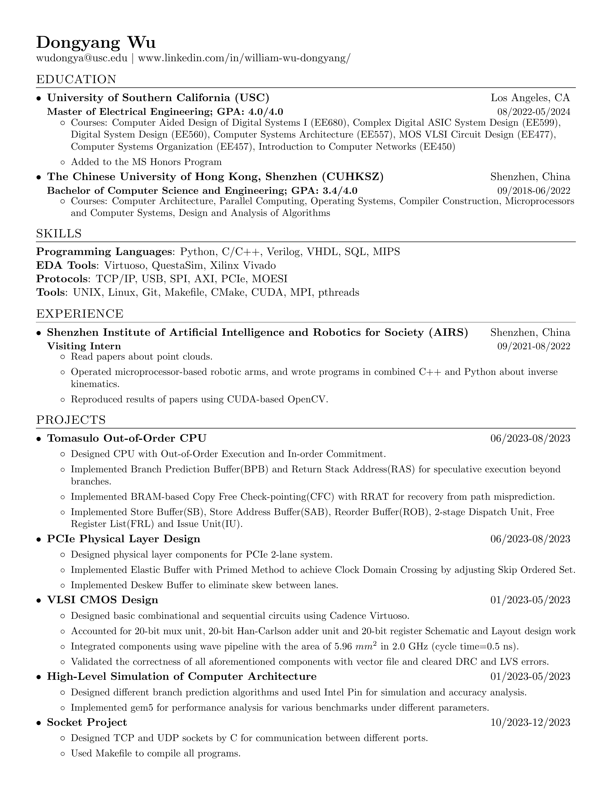

# Resume
> Original Repository: https://github.com/sb2nov/resume
>
> Original Repository Files: `original/`
> 
> About me: https://www.iwktd.com/

Original Repository Feature: 
* A single-page, one-column resume for general purpose.
* Base latex templates and fonts to provide ease of use.

Difference comparing with original repository: 
* Summarize user-friendly instructions in README
* Use `config.yml` to organize the information to share information across different purpose. 
* Automatically generate the `template.pdf` and `template.png` with GitHub Actions.
* Add extra LaTeX commands to suit more applications.
* Comply with rules from USC recommendations in VMock.
    * Bold for job title.
    * NO italic for duration.
* Modify general information section format to avoid confusion.
    * Old template results in wrong name on myworkdayjobs.com .
    * Refer to [`old_version` branch](https://github.com/Karl-Han/resume/tree/old_template).

## Preview



It will be automatically generated after committing the `config.yml`. 

## How to Use
There are three/four ways to generate PDF: 
* GitHub Actions does everything except filling `config.yml` (MOST convenient)
* Modify Overleaf directly
* Install TeX command line tool and Use YAML to maintain content
    * In docker
    * Local machine 

In this README, I will only present the GitHub Actions method and the others will be in [Methods](./methods.md).

### GitHub Action
Steps: 
1. Fork this repository.
2. Learn the format of YAML: [Simple Guide](https://www.cloudbees.com/blog/yaml-tutorial-everything-you-need-get-started).
3. Read the short [Practical Guide](#practical-guide) for `config.yml` to know the most-used structures.
4. Refer to [config.yml format](#configyml-format), study the structures by looking at `template.pdf` and `config.yml` side by side. 
5. Modify `config.yml` with your content and make sure `config.yml` is syntactically correct.
  * [Online Lint](https://www.yamllint.com/) if you need.
6. Commit it to the repository. 
7. ~~Then make a cup of tea.~~ Wait for the GitHub Actions to complete. Link example: https://github.com/Karl-Han/resume/actions
8. Get the `template.pdf` in the repository! Your new Resume! You are all set!

For further reuse, please follow me or refer to [sproogen/modern-resume-theme](https://github.com/sproogen/modern-resume-theme) website. I have [my own website](https://www.iwktd.com/) with this template. 

## Practical Guide
There are hierarchies inside the YAML: 
* Section (inside a global `content`): comprises 
  * Items (Experience Section) with `section.layout` = `list`
  * or a few sentences below it (Skills Section) with `section.layout` = `text`
* Item (inside a section's `content`): is project or company you have worked on (CS Department, USC under Experience Section or Design and Implementation of 5-stage Pipeline Processor)
* Item Description (inside an Item's `description`): just a sentence saying what you have done or describe the Item


### Item

Refer to [available YAML format](#configyml-format), there are two practical ways to add item/project to a section with `list` as `layout`: 

>   You can DEFINITELY write duration in location's place! What matters most is that how many lines you want to let others know about that project/position.

*   Write one with second line by filling all `title`, `location`, `sub_title` and `duration` for that item in the section. 
*   Write one without second line by filling only these two, i.e., `title`, `location` for that item in the section. 

### Re-order the Sections
If you want to re-order the sections, just look at the [order keyword](#configyml-format). 

You can see the example in `config.yml`.

## Motivation

I love to use structured format, like Markdown and LaTeX, to present my notes and article. So I choose Sourabh Bajaj's template. And I modified the original template to fit USC's requirements of better resume on VMock. 

Also, I have set up personal resume website: https://www.iwktd.com/ to let others know me comprehensively instead of one-page resume. 

So I have the demand to share the same information across different repository and use YAML as the language to organize my information. 

Thanks to [Firfi's PR](https://github.com/sb2nov/resume/pull/46), I integrated the GitHub Actions into this repository, so that you no longer need to install the environment or Docker in your computer!

## License

Format is MIT but all the data is owned by Kunlin Han.

## Acknowledge

This repository is originated from [sb2nov/resume](https://github.com/sb2nov/resume). Thank Sourabh Bajaj for this well organized latex template. For the original files, please refer to `original/` and the [original repository](https://github.com/sb2nov/resume). 

## Appendix

### config.yml format
Some of them can be replaced with `""` to set them to blank, but it depends. 

Below is a full list of content options.
```yml
name: Your name
email: Your email
phone: Your phone
website: Your website or ""

order:
  - Section 1 title
  - Section 2 title
  - Section 3 title
  # You can omit sections to implicitly set section.show = false...
content:
  - title: Section Name
    layout: list # (options: list, text)
    content:
      - show: false # (options: true, false)
        title: Item Name (eg. Company or Project name)
        location: Location of this title
        # These two are **optional**, but you have to use both or none
        sub_title: Sub title (eg. Qualification or Job title)(optional)
        duration: Duration for the sub-title, e.g., Aug. 2022-Sept. 2023

        # NOT USED. link: Web link (eg. https://sproogen.github.io/modern-resume-theme)(optional)
        description: # this will include new lines to allow paragraphs
          - Point1 Main content area for the list item.
          - Point2 for this Item
  - title: Section Name
    layout: text # (options: list, text)
    content: # this will include new lines to allow paragraphs
      - Line1 This is where you can write a little more about yourself. You could title this section **Interests** and include some of your other interests.
      - Line2 Or you could title it **Skills** and write a bit more about things that make you more desirable, like *leadership* or *teamwork*
```

### Extra LaTeX Command

* `\resumeSubheadingNoTitle`: only takes the first line of subheading without job title and duration. 

    

* `\resumeItemOne`: only takes the description instead of skill + description, unlike the original repository. 
